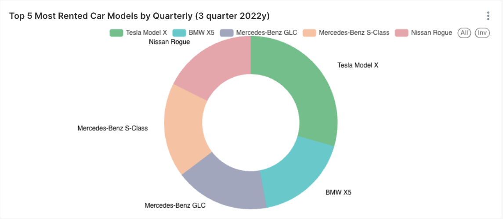

## Table of Contents
- [Database set up](#database-set-up)
    - [Prerequisites](#prerequisites)
    - [Create and populate database](#create-and-populate-database)
- [Visualisation](#visualisation)
    - [Superset set up](#superset-set-up)
    - [Dashboard](#dashboard)
- [ER diagram](#er-diagram)

## Database set up
#### Prerequisites
If you don't have docker and docker-compose installed, firstly run:
```
chmod +x install_docker.sh
./install_docker.sh
```
#### Create and populate database
Simple run:
```
docker-compose up -d
```
## Visualisation 
#### Superset set up
Clone superset repository
```
git clone --depth=1  https://github.com/apache/superset.git
cd superset
```

Build last stable version
```
export TAG=3.1.1
docker compose -f docker-compose-image-tag.yml up
```

After finishing, superset ui should be available on http://localhost:8088
Log in with the default username and password:
```
username: admin
password: admin
```


#### Dashboard



## ER diagram
